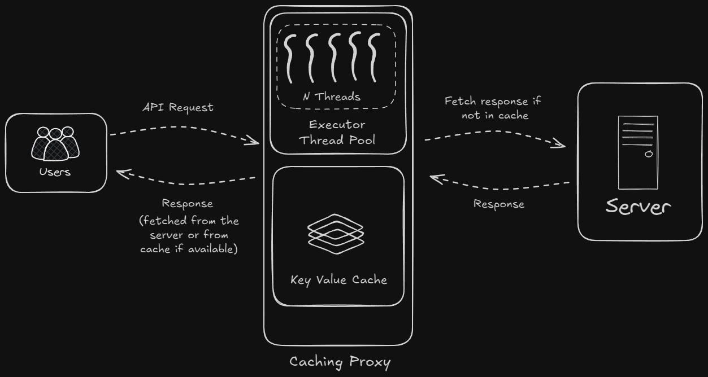
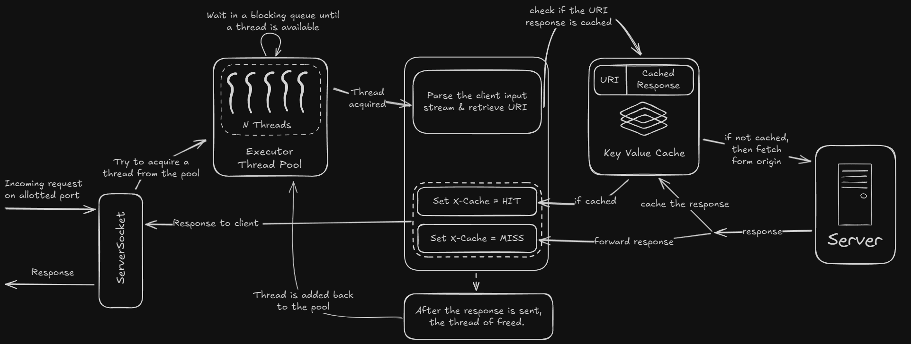

# Caching Proxy Server

This project is a simple caching proxy server built using Java and Maven. It acts as an intermediary between a client and an origin server, caching responses to improve performance and reduce latency.



For a more detailed diagram - [Detailed Flow](#detailed-flow)

## Features

*   **Caching:**  Caches responses from the origin server based on the request URI.
*   **Command-Line Arguments:** Configurable via command-line arguments for port and origin server URL.
*   **Cache Clearing:**  Provides an option to clear the cache.
*   **Concurrency:** Handles multiple client requests concurrently using a thread pool.
*   **X-Cache Header:** Adds an `X-Cache` header to responses to indicate whether the response was served from the cache (HIT) or the origin server (MISS).

## Prerequisites

*   Java Development Kit (JDK) 17 or later
*   Maven

## Getting Started

1.  **Clone the repository (if applicable):**

    ```bash
    git clone <repository_url>
    cd caching-proxy
    ```

2.  **Build the project:**

    ```bash
    mvn clean install
    ```

    This will download dependencies, compile the code, and create a JAR file in the `target` directory.

## Running the Proxy

```bash
java -jar target/caching-proxy-1.0-SNAPSHOT-jar-with-dependencies.jar --port <port_number> --origin <origin_url>

```

*   `<port_number>`:  The port on which the proxy server will listen (e.g., `3000`).
*   `<origin_url>`: The URL of the origin server to which requests will be forwarded (e.g., `http://dummyjson.com`).
*   (optional) `<pool_size>`: Set the thread pool size (default-10`). Ideally 2-3 times the cores available in the system or less

**Example:**

```bash
java -jar target/caching-proxy-1.0-SNAPSHOT-jar-with-dependencies.jar --port 3000 --origin http://dummyjson.com
```

This starts the proxy server on port 3000, forwarding requests to `http://dummyjson.com`.


```bash
java -jar target/caching-proxy-1.0-SNAPSHOT-jar-with-dependencies.jar --port 3000 --origin http://dummyjson.com --port-size 12
```

This starts the proxy server on port 3000, forwarding requests to `http://dummyjson.com`, with thread pool size 12.


## Testing the Proxy

After starting the proxy, you can send requests to it using a web browser, `curl`, or any other HTTP client.

**Example using `curl`:**

```bash
curl http://localhost:3000/products -v
```

The `-v` flag in `curl` will show the HTTP headers, including the `X-Cache` header.

**Example using `browser`:**

Simply perform a normal search 

```bash
http://localhost:3000/products
```

Use the network tab in DevTool to get all the information about the request.

The first request to a particular URL will result in an `X-Cache: MISS`, and subsequent requests to the same URL will result in an `X-Cache: HIT`.

## Creating a Shortcut Script

To simplify execution, you can create a script.

### Windows (Batch File)

1.  Create a file named `caching-proxy.bat` in the project root.
2.  Add the following content:

    ```bat
    @echo off
    cd "%~dp0"
    java -jar "target/caching-proxy-1.0-SNAPSHOT-jar-with-dependencies.jar" %*
    ```

3.  Now, you can run the tool with:

    ```
    caching-proxy --port 3000 --origin http://dummyjson.com
    ```
    ```
    caching-proxy --port 3000 --origin http://dummyjson.com --pool-size 12
    ```

### Linux/macOS (Shell Script)

1.  Create a file named `caching-proxy` in the project root.
2.  Add the following content:

    ```sh
    #!/bin/bash
    cd "$(dirname "$0")"
    java -jar "target/caching-proxy-1.0-SNAPSHOT-jar-with-dependencies.jar" "$@"
    ```

3.  Make the script executable:

    ```
    chmod +x caching-proxy
    ```

4.  Now, you can run the tool with:

    ```
    ./caching-proxy --port 3000 --origin http://dummyjson.com
    ```


### Making It Globally Accessible

To run the tool from any directory:

1.  Add the project directory to the system `PATH`:
*   On Windows:
    *   Open *System Properties* -> *Advanced* -> *Environment Variables*.
    *   Under *System variables*, find `Path` and edit it.
    *   Add the absolute path of the project root.
*   On Linux/macOS:

    ```sh
    echo 'export PATH="$HOME/path-to-project:$PATH"' >> ~/.bashrc
    source ~/.bashrc
    ```

2.  Now, you can run the tool from anywhere using:

    ```
    caching-proxy --port 3000 --origin http://dummyjson.com
    ```


## Dependencies

*   **Apache HttpClient:**  For making HTTP requests to the origin server.
*   **SLF4J Simple:** For logging.
*   **JCommander:** For parsing command-line arguments.

## Future Enhancements

*   Support for more HTTP methods (e.g., POST, PUT, DELETE).
*   More sophisticated caching strategies (TTL, LRU, Cache-Control headers).
*   Improved error handling.
*   Configuration via a configuration file.
*   Thread-safe cache implementation (e.g., using `ConcurrentHashMap`).
*   Buffering for improved socket performance.

## Detailed Flow
